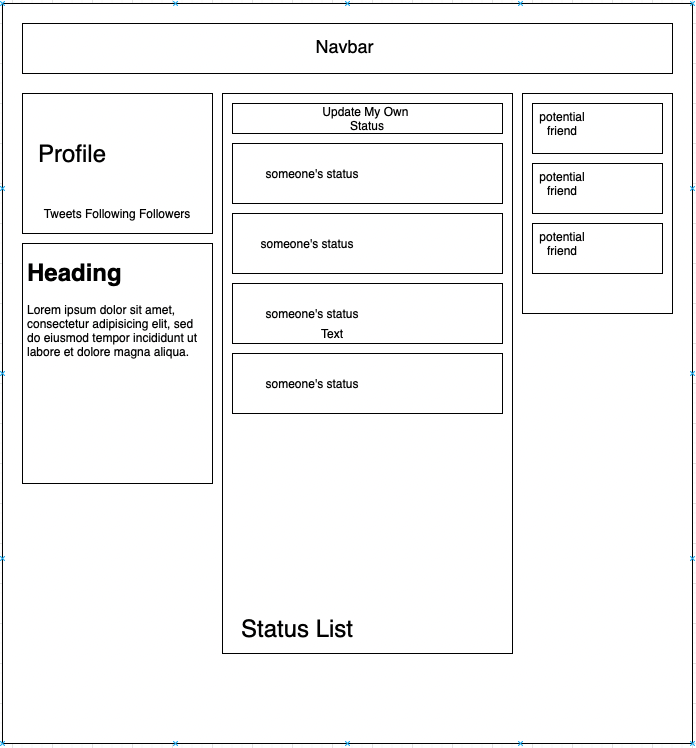

# _Social Media Clone_

#### _Social Media Clone_

#### By _**Jennifer Bordon and Kristen Hopper**_

## Technologies Used

* _Git_
* _HTML_
* _CSS_ 
* _Bootstrap_
* _jQuery_
* _JavaScript_
* _npm_
* _webpack_
* _jest_

## Description
This project demonstrates the use of React in framing a clone of a social media website. 

## Setup/Installation Requirements
* Clone this project into your preferred directory
* In that directory, there should now be a directory labeled "social-media"
* run `npm i` to install respective plugins/packages
* run `npm start` to go see a live server of the app

## Known Bugs

* There are no known issues with this project.

## License

Distributed under the MIT License. See LICENSE for more information.

## Contact Information

_jennifer.bordon@gmail.com_

_hopperdavis@gmail.com_

